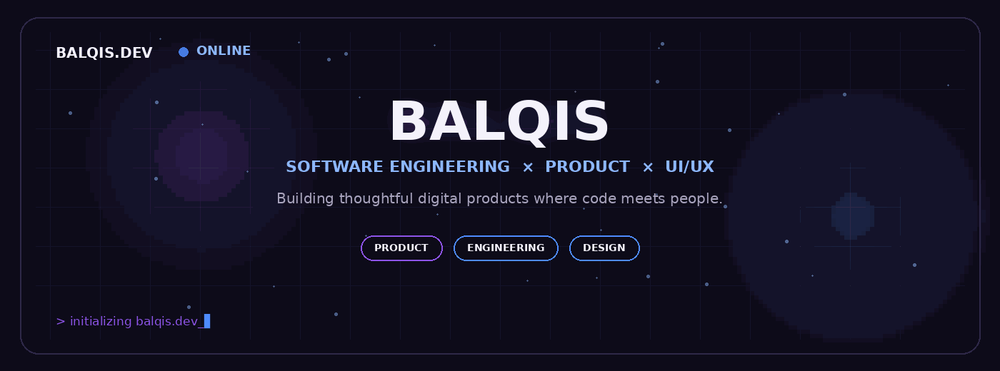
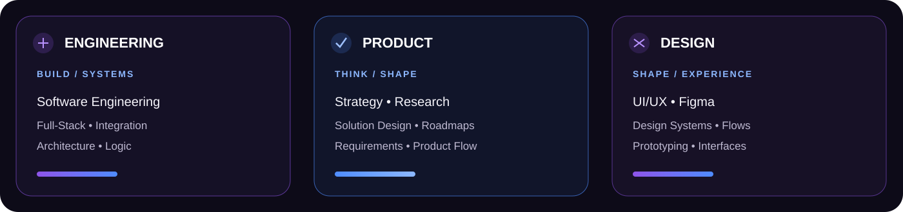
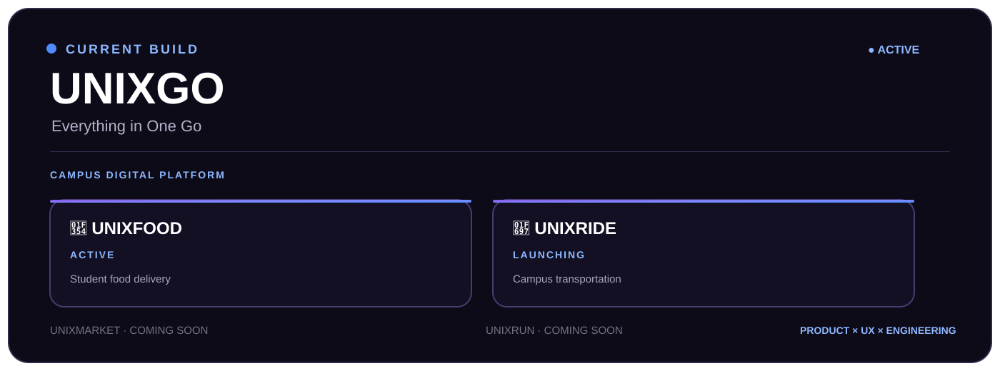
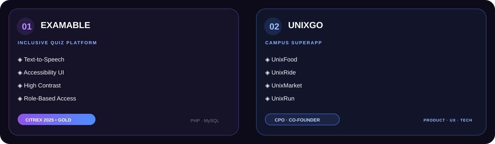
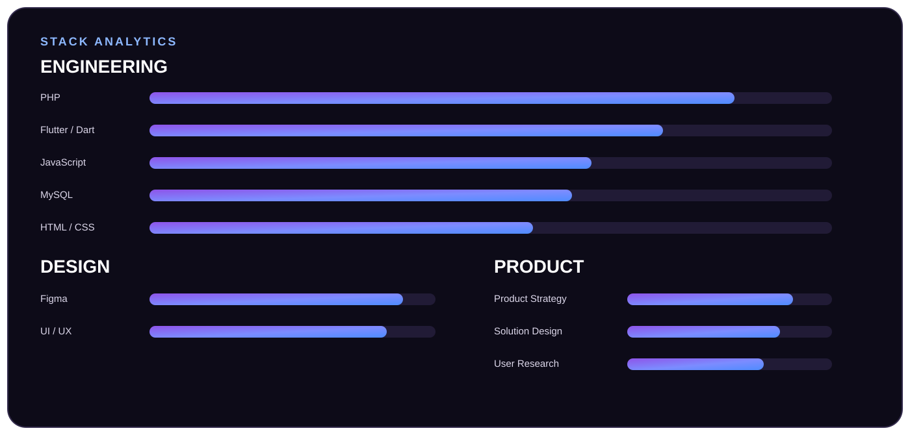
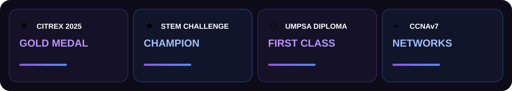

  

  

 

## `01` — Identity

 

## `02` — Current Build

**CPO & Co-Founder** · `UnixGo Enterprise` · `2025 → NOW`

`UnixFood` · `UnixRide` · `UnixMarket` · `UnixRun`

 

## `03` — Featured Work

 

## `04` — Stack

 

## `05` — Highlights

 

## `06` — Contributions

 

## `07` — Let's Connect

  

