  

 

  

 

## About Me

I'm a Software Engineering student at **Universiti Malaysia Pahang Al-Sultan Abdullah (UMPSA)**, and I previously completed a **Diploma in Computer Science (First Class)**, also at UMPSA.

I work across the full stack of building software — from system design and full-stack development to UI/UX and product strategy. I care about writing reliable code, but I care just as much about how people actually experience what I build.

My focus areas:

<table>
<tr>
<td width="33%" valign="top">

**🧩 Engineering**
- Software Engineering
- Full-Stack Development
- System Design & Integration

</td>
<td width="33%" valign="top">

**🎨 Design**
- UI/UX Design
- Design Systems
- User-Centered Software

</td>
<td width="33%" valign="top">

**🚀 Product**
- Product Development
- User Research
- Solution Design

</td>
</tr>
</table>

 

## 🚧 Currently Building — UnixGo

**UnixGo Enterprise** · *Chief Product Officer (CPO) & Co-Founder* · Dec 2025 – Present

> **"UnixGo, Everything in One Go"**
> Built by Students. For Students.

UnixGo is a campus-focused digital platform bringing everyday student services into one place.

| Live Now | Coming Soon |
|---|---|
| 🍔 **UnixFood** | 🛍️ UnixMarket |
| 🚗 **UnixRide** | 🏃 UnixRun |

**What I own on this:** product strategy, product vision & roadmap, feature requirements, user research, user flows, wireframes, UI/UX, Figma design systems, solution design, product documentation, business proposals, presentation materials, branding & digital experience — working closely with the development team to bring it all together.

 

## ⭐ Featured Project — ExamAble

**Final Year Project** · Nov 2024 – Jun 2025 · 🥇 **Gold Medal, CITREX 2025**

An inclusive digital quiz platform designed to improve accessibility in online assessment — built with role-based access for Admin, Lecturer, Student, and Guest.

**Accessibility features:**
- 🔊 Text-to-speech
- 🔠 Font adjustment
- 🌓 High-contrast themes
- 🔐 Role-based access (Admin / Lecturer / Student / Guest)

`PHP` · `MySQL`

> ExamAble is presented here as a case study — the source code isn't publicly hosted yet.

 

## 💼 Experience

<table>
<tr>
<td width="30%"><b>Chief Product Officer & Co-Founder</b> UnixGo Enterprise</td>
<td width="15%">Dec 2025 – Present</td>
<td>Product strategy, UX, solution design, product requirements, design systems, branding and digital experience.</td>
</tr>
<tr>
<td width="30%"><b>User Interface Designer</b> HeiTech Padu Berhad</td>
<td width="15%">Aug 2025 – Jan 2026</td>
<td>UI/UX for large-scale government digital systems, including MySIKAP, MyJPJ, NIISe, SmED, SLD, eLelong, and KBS — Figma design systems, reusable components, user flows, sitemaps, wireframes, high-fidelity interfaces, forms, tables, alerts, states, design documentation, and supporting system analysts.</td>
</tr>
<tr>
<td width="30%"><b>Final Year Project Developer</b> UMPSA</td>
<td width="15%">Nov 2024 – Jun 2025</td>
<td>Designed and developed ExamAble, an accessible online quiz platform.</td>
</tr>
</table>

 

## 🧰 Toolkit

<table>
<tr>
<td valign="top" width="25%">

**Development**

     

</td>
<td valign="top" width="25%">

**Design**

   

</td>
<td valign="top" width="25%">

**Engineering**

   

</td>
<td valign="top" width="25%">

**Product**

   

</td>
</tr>
</table>

 

## 🏆 Achievements

- 🏆 **First Class Diploma in Computer Science** — UMPSA
- 🥇 **CITREX 2025 — Gold Medal** for *ExamAble*
- 🏆 **STEM Online Challenge — Champion**, Novice Web Builder
- 📡 **CCNAv7: Introduction to Networks**

 

## 📊 GitHub Activity

 

 

## 🐍 Contributions

 

### Let's connect

Software Engineering Student · Product Builder · UI/UX

